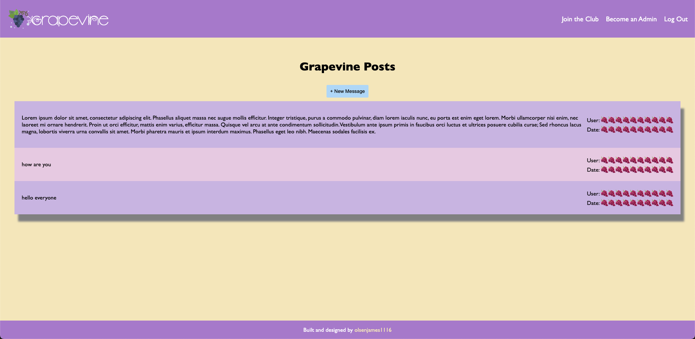
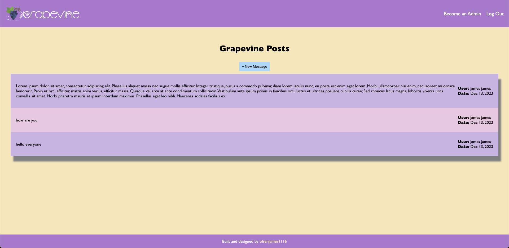
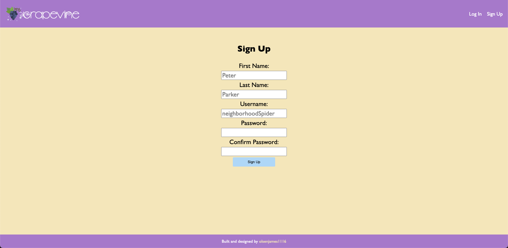
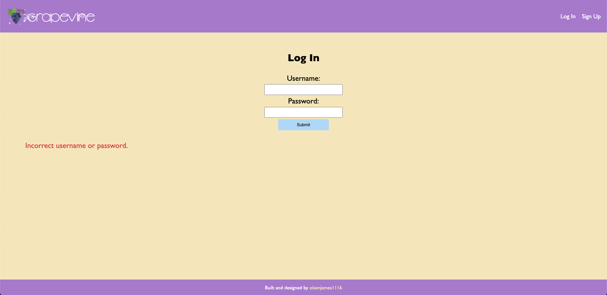
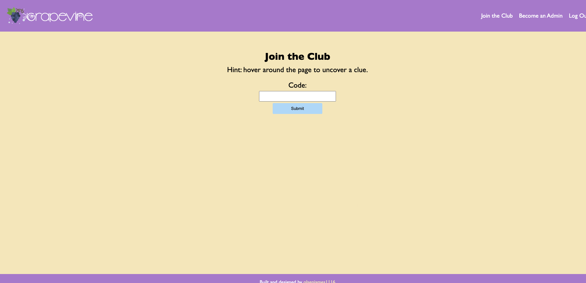
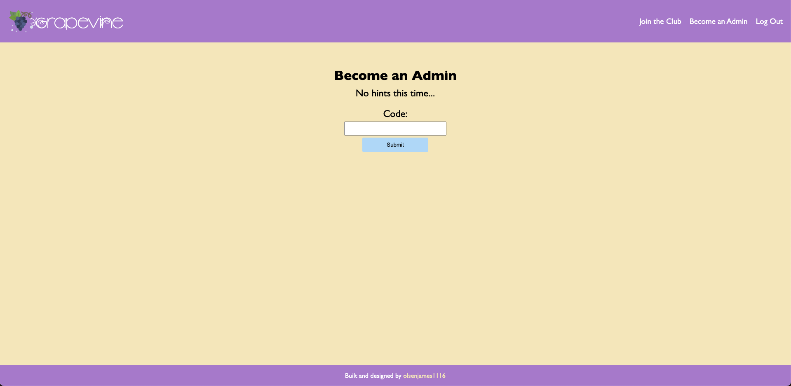

# Grapevine

## Previews

Home page for non-members:

Home page for members:

Sign Up:

Log In:

Join the club:

Become an admin:

## Description

An exclusive club for people who want to say what's on their mind. While anyone with an account can post a message on the home page, only members can view who posted it and when. Join the club with a code word to view who posted a message and on what date. Admins can delete posts but users can only be made an admin through another code word.

This project highlights:

- Mongoose/MongoDB
- Express
- Passport
- Bcrypt
- MVC architecture
- dotenv
- Environment variables
- Pug

© 2024 James Olsen. All Rights Reserved.
